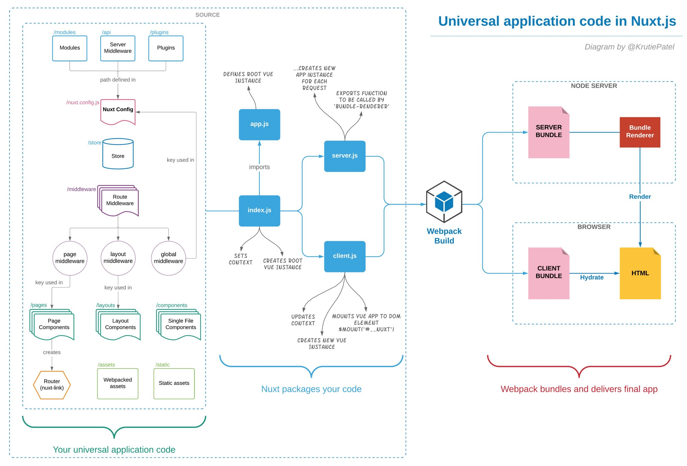

# SpaceFarm

>Live demo: https://spacefarm.ai

## Build Setup

```bash
# install dependencies
$ npm install

# serve with hot reload at localhost:3000
$ npm run dev

# build for production and launch server
$ npm run build
$ npm run start

# generate static project
$ npm run generate
```

> For detailed explanation on how things work, check out the [documentation](https://nuxtjs.org).

## Special Directories

You can create the following extra directories, some of which have special behaviors. Only `pages` is required; you can delete them if you don't want to use their functionality.

### `assets`

The assets directory contains your uncompiled assets such as Stylus or Sass files, images, or fonts.

> More information about the usage of this directory in [the documentation](https://nuxtjs.org/docs/2.x/directory-structure/assets).

### `components`

The components directory contains your Nuxt.js components. Components make up the different parts of your page and can be reused and imported into your pages, layouts and even other components.

> More information about the usage of this directory in [the documentation](https://nuxtjs.org/docs/2.x/directory-structure/components).

### `layouts`

Layouts are a great help when you want to change the look and feel of your Nuxt app, whether you want to include a sidebar or have distinct layouts for mobile and desktop.

> More information about the usage of this directory in [the documentation](https://nuxtjs.org/docs/2.x/directory-structure/layouts).


### `pages`

This directory contains your application views and routes. Nuxt will read all the `*.vue` files inside this directory and setup Vue Router automatically.

> More information about the usage of this directory in [the documentation](https://nuxtjs.org/docs/2.x/get-started/routing).

### `plugins`

The plugins directory contains JavaScript plugins that you want to run before instantiating the root Vue.js Application. This is the place to add Vue plugins and to inject functions or constants. Every time you need to use `Vue.use()`, you should create a file in `plugins/` and add its path to plugins in `nuxt.config.js`.

> More information about the usage of this directory in [the documentation](https://nuxtjs.org/docs/2.x/directory-structure/plugins).

### `static`

This directory contains your static files. Each file inside this directory is mapped to `/`.

Example: `/static/robots.txt` is mapped as `/robots.txt`.

> More information about the usage of this directory in [the documentation](https://nuxtjs.org/docs/2.x/directory-structure/static).

### `store`

This directory contains your Vuex store files. Creating a file in this directory automatically activates Vuex.

> More information about the usage of this directory in [the documentation](https://nuxtjs.org/docs/2.x/directory-structure/store).

## Directory structure

````
├── .nuxt                                       // bandle of server 
├── .vscode                                     // config for Visual Code redactor, for having one style of code  
├── assets                                      // static resource like themes, fonts
│   ├── fonts                                   // fonts
│   └── scss                                    // sass modules
├── components                                  // directory of components project 
│   ├── Container.vue                           // wrapper for all inner content
│   └── Modal.vue                               // that displays in front of and deactivates all other page content
├── layouts                                     // default layout for pages who have some layout
|   ├── default.vue                             // default layout
|   ├── empty.vue                               // empty layout
|   └── error.vue                               // error layout
├── node_modules                                // directory of global plugins or libraries for all project
├── page                                        // page components, that component creates view and routes
|   ├── c02                                     // c02 page directory
|   └── └── _id                                 // c02 page with dynamic id param (https://spacefarm.ai/c02/5)
|   ├── temperature                             // temperature page directory
|   └── └── _id_.vue                            // temperature page with dynamic id param (https://spacefarm.ai/temperature/12)
|   ├── climateandzone.vue                      // climate and zone settings page (https://spacefarm.ai/climateandzone)
|   ├── handcontrol.vue                         // hand control page (https://spacefarm.ai/handcontrol)
|   ├── index.vue                               // main page of project - farm page (https://spacefarm.ai/)
|   ├── login.vue                               // login page (https://spacefarm.ai/login)
|   ├── orders.vue                              // orders page (https://spacefarm.ai/orders)
|   ├── register.vue                            // register page (https://spacefarm.ai/register)
|   ├── scada.vue                               // scada page (https://spacefarm.ai/scada)
|   └── tasks.vue                               // tasks page (https://spacefarm.ai/tasks)
├── plugins                                     // directory of global plugins for all project
|   └── BodyScroll.js                           // plugin for control scroll bar
├── static                                      // directory having images or icons of all project
├── nuxt.config.js                              // configuration file for Nuxt.js
└── package.json                                // package of all libraries and plugins for project
````

## How universal Nuxt app is work

